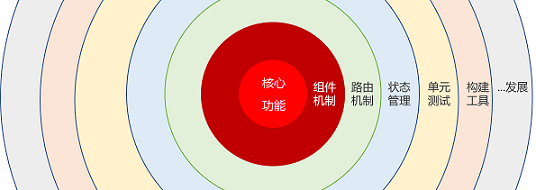

# Vue-learning
vue.js学习路径

##视图层
**指令**
- `{{ }}`
- `v-if` / `v-else` / `v-else-if`
- `v-show`
- `v-for`
- `v-bind` / `:`
- `v-on` / `@`
- `v-model`

**样式**
- `v-bind:class`
- `v-bind:style`

**特殊特性**
- `key`
- `ref`

**过渡动画**

- css过渡：`<transition name="">`
- js过渡： `<transition v-on:method`

**模板形式**
- `HTML`
- `template`
- `render`方法：`createElement`
- `render`方法：`JSX`

## 逻辑层
**通用配置选项option**

- `data`
- `computed`
- `methods`
- `watchers`
- `filters`
- `mixins`
- `directive`

**生命周期钩子函数**
- `beforeCreate`
- **`created`**
- ` beforeMount`
- **` mounted`**
- `beforeUndate`
- **`undated`**
- `beforeDestory`
- `destory`
- `activated` (`keep-alive`)
- `deactivated` (`keep-alive`)

## 组件 `Component`
## 路由 `Vue-router`
## 状态管理 `Vuex`
## 单元测试 `ue-test-utils`
## 项目构建`vue-cli`

## 进阶内容
- 响应式原理
- 虚拟DOM
- 模板编译原理
- `Vue API`和`vm API`