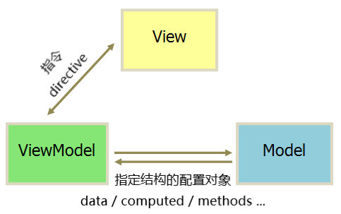

# 《vue.js快跑》
2019-3-31
## 为什么选择Vue
    有这个一个需求，我们需要根据后端数据接口请求返回的数组在页面中按列表展示？
    传统上我们使用jQuery的Ajax发送http请求，获取数据。判断列表数据是否存在，如果不存在，显示一条提示信息;如果存在，则显示出来。
```html
    <ul class="js-data"></ul>
```
```js
    <script>
        $(document).ready(function () {
            $.get("https://example.com/api/data")
                .then( function (res) {
                    var $ul = $(".js-data")

                    if (!res.data.length) {
                        var $noItem = $("<li>")
                        $noLi.text("sorry, there are no data")
                        $ul.append($noItem)
                    } else {
                        res.data.forEach( function (item) {
                            var $li = $("<li>").text(item)
                            $ul.append($li)
                        })
                    }
                })
        })
    </script>
```
[DEMO 1-1 jQuery create list](https://jsrun.net/xEXKp/edit)

    jQuery 这段代码执行了以下逻辑：
        1. 使用$.get()发起Ajax，获得数据列表；
        2. 获得要挂载列表的ul元素；
        3. 如果请求响应的结果中没有数据，则创建一个li元素，显示一段提示文本；
        4. 如果有数据，则遍历每一个数据项目，将数据内容添加至li元素中；
        5. 并将li元素挂载到ul元素上。

在这个例子js中，我们不仅要处理数据（请求数据，并判断响应的数据是否存在），还要处理视图中的DOM元素（创建li元素，并挂载到ul元素中）。

下面我们用VUE框架来处理上面的需求
``` html
    <ul class="js-items">
        <li v-if="!items.length">sorry, thert are no data</li>
        <template v-else>
            <li v-for="item in items">{{ item }} </li>
        </template>
    </ul>
```
```js
    <script>
        new Vue({
            el: ".js-items",
            data: {
                items: []
            },
            created() {
                fetch("https://example.com/api/data")
                    .then(res = > {
                        this.items = res.data.items
                    })
            }
        })
    </script>
```
[DEMO 1-1 Vue create list](https://jsrun.net/tEXKp/edit)

    VUE 这段代码执行了以下逻辑：
        1. 使用fetch()发起了一个Ajax请求；（当然也可以用其它请求API，如axios)
        2. 将返回数据赋值给data对象中的items属性

在VUE这个例子中，我们只需要按VUE的语法写好HTML部分，然后在script中请求数据，并完成赋值，视图会自动更新，与上面jQuery呈现的页面完全一样。

在VUE这里，视图HTML部分和逻辑SCRIPT部分完全分开，只专注于各自的业务，我们不用在js中操作DOM，VUE框架的内部会自动帮我们处理。这就是MVVM模式，View（视图） 和 Model（数据） 分离，由框架核心ViewModel控制两者关联。

## VUE的MVVM模型
>关于MVC / MVP / MVVM  理解可以查看[阮一峰的blog](http://www.ruanyifeng.com/blog/2015/02/mvcmvp_mvvm.html)



在web应用中，最底层最基础的结构是HTML / CSS / Javascript。分别处理页面的结构、样式、行为。

换个角度看，我们也可以把页面划分为视图层和逻辑层。视图层由HTML/CSS处理，逻辑层由JS处理。

按这样划分，我们学习的方向就是VUE框架是如何控制视图层显示，以及如何与逻辑层交互的。

VUE将视图层HTML抽象为一个模板template，作为VUE的template属性的值，模板中HTML元素通过VUE提供的面向视图层的API --叫做指令directive -- 来建立视图层view和viewModel的联系。

VUE向逻辑层model提供的API包括data/methods/computed/watch/filter/component等等。

[DEMO 1-1 template  / data](https://jsrun.net/nEXKp/edit)

>vue在template中实现视图逻辑，在js中实现业务逻辑

```html
    <div id="app"></div>
```
```js
    <script>
        new Vue({
            // 视图层view
            template: `<ul class="js-items">
                        <li v-if="!items.length">sorry, thert are no data</li>
                        <template v-else>
                            <li v-for="item in items">{{ item }} </li>
                        </template>
                    </ul>`,

            // 逻辑层model
            el: "#app",
            data: {
                items: []
            },
            created() {
                fetch("https://example.com/api/data")
                    .then(res = > {
                        this.items = res.data.items
                    })
            }
        })
    </script>
```

## vue:The Progressive Framework
> 参考《深入浅出Vue.js》第一章 p3

**vue 的主要历史**

- 2013年7月28日 尤雨溪在GitHub上提交第一个commit。此时还不叫`vue`，叫`Element`，后又更名为`Seed.js`
- 2013年12月7日 发布`v 0.6.0`版，正式更名为`Vue.js`，并且把指令系统写法改为`v-`。这一版本代表`vue`正式问世
- 2015年10月26日 正式发布`v 1.0.0`
- 2016年10月1日 国庆 发布`v 2.0.0`

**`vue`定位变化**

在最早的`vue`只专注于视图层，没有路由，没有状态管理，也没有官方构建工具，只是一个库，相当一个新视图模板库。

后来，为了适应不同应用场景，慢慢加入了一些官方辅助工具，如路由`Router`、状态管理`Vuex`等。
但是在这个演变发展过程中，`vue`始终维持一个理念：”这个框架应该是**渐近式**的
也就是`vue`的目前的定位：The Progressive Framework

**vue 渐近式框架的理解**

所谓渐近式框架，就是把框架分层。
最核心的部分是视图层渲染，然后往外是组件机制，在此基础上加入路由机制，加入状态管理，添加单元测试，使用构建工具等。除了核心部分，其它部分都可以根据应用需求添加，不是必需的。


