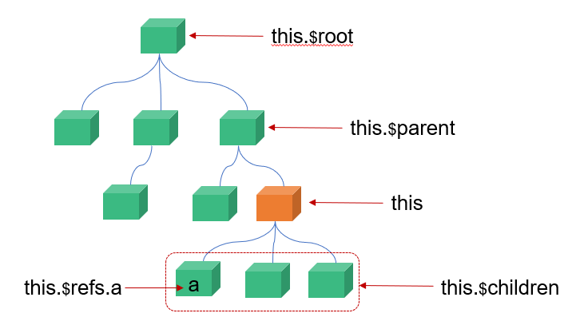

# 组件实例的引用方式

- `ref / $refs`
- `$root`
- `$parent`
- `$children`
- 扩展查找任意组件实例的方法

在vue开发的项目中，通常会以一棵嵌套的组件树的形式来组织项目。
- 都存在着一个根组件
- 组件同时也都是 Vue 实例，组件间可以嵌套使用，形成了树状的级联形式，也就形成了父子组件、兄弟组件、祖先或后代组件这些关系。


在实际开发中，有时需要获取某个组件实例来引用其数据或方法。在前面讲解组件API的`event`时，通过`ref / $refs`调用组件实例来进行事件监听和触发。但`$refs`只能引用该组件下的子组件。

但实际上`vue`还提供其它几个API来获取组件实例`$root / $parent / $children`，我们也可以基于这些来扩展查找组件实例的便捷方法。


```html
<div id="app">
    <child1></child1>
</div>
```
```js
const child1 = Vue.extend({template: `<div>子组件1<child1_1></child1_1></div>`})
const child1_1 = Vue.extend({
    template: `<div>
        <button @click="handleClick">子组件1_1，点击打印</button>
        <child1_1_1></child1_1_1>
        <child1_1_2 ref="child1_1_2"></child1_1_2/>
        </div>`,
    methods: {
        handleClick() {
            console.log('this:',this.$vnode.tag)
            console.log('this.$root:',this.$root)
            console.log('this.$parent:',this.$parent.$vnode.tag)
            console.log('this.$children:',this.$children)
            console.log('this.$children[0]:',this.$children[0].$vnode.tag)
            console.log('this.$children[1]:',this.$children[1].$vnode.tag)
            console.log('this.$refs.child1_1_2:',this.$refs.child1_1_2.$vnode.tag)
        }
    }
    })
const child1_1_1 = Vue.extend({template: `<div>子组件1_1_1</div>`})
const child1_1_2 = Vue.extend({template: `<div>子组件1_1_2</div>`})

Vue.component('child1',child1)
Vue.component('child1_1',child1_1)
Vue.component('child1_1_1',child1_1_1)
Vue.component('child1_1_2',child1_1_2)

const vm = new Vue({
    el: "#app",
})
```
```
this: vue-component-2-child1_1
this.$root: Vue {_uid: 0, _isVue: true, $options: {…}, _renderProxy: Proxy, _self: Vue, …}
this.$parent: vue-component-1-child1
this.$children: [VueComponent, VueComponent]
this.$children[0]: vue-component-3-child1_1_1
this.$children[1]: vue-component-4-child1_1_2
this.$refs.child1_1_2: vue-component-4-child1_1_2
```

#### 根据组件名称查找任意组件实例

[点击查看参考链接：https://github.com/icarusion/vue-component-book](https://github.com/icarusion/vue-component-book)

场景：
- 由一个组件，向上找到最近的指定组件
- 由一个组件，向上找到所有的指定组件
- 由一个组件，向下找到最近的指定组件
- 由一个组件，向下找到所有指定的组件
- 由一个组件，找到指定组件的兄弟组件

实现：
结合`$parent / $children`，通过递归、遍历查找与指定组件的name选项匹配的组件实例。
```js
// 由一个组件，向上找到最近的指定组件
function findComponentUpward (context, componentName) {
    let parent = context.$parent;
    let name = parent.$options.name;

    while (parent && (!name || [componentName].indexOf(name) < 0)) {
        parent = parent.$parent;
        if (parent) name = parent.$options.name;
    }
    return parent;
}
```

```js
// 由一个组件，向上找到所有的指定组件
function findComponentsUpward (context, componentName) {
    let parents = [];
    const parent = context.$parent;

    if (parent) {
        if (parent.$options.name === componentName) parents.push(parent);
        return parents.concat(findComponentsUpward(parent, componentName));
    } else {
        return [];
    }
}
```
```js
// 由一个组件，向下找到最近的指定组件
function findComponentDownward (context, componentName) {
    const childrens = context.$children;
    let children = null;

    if (childrens.length) {
        for (const child of childrens) {
            const name = child.$options.name;

            if (name === componentName) {
                children = child;
                break;
            } else {
                children = findComponentDownward(child, componentName);
                if (children) break;
            }
        }
    }
    return children;
}
```

```js
// 由一个组件，向下找到所有指定的组件
function findComponentsDownward (context, componentName) {
    return context.$children.reduce((components, child) => {
        if (child.$options.name === componentName) components.push(child);
        const foundChilds = findComponentsDownward(child, componentName);
        return components.concat(foundChilds);
    }, []);
}
```

```js
// 由一个组件，找到指定组件的兄弟组件
// 每个vue组件实例都有一个唯一的_uid
function findBrothersComponents (context, componentName, exceptMe = true) {
    let res = context.$parent.$children.filter(item => {
        return item.$options.name === componentName;
    });
    let index = res.findIndex(item => item._uid === context._uid);
    if (exceptMe) res.splice(index, 1);
    return res;
}
```