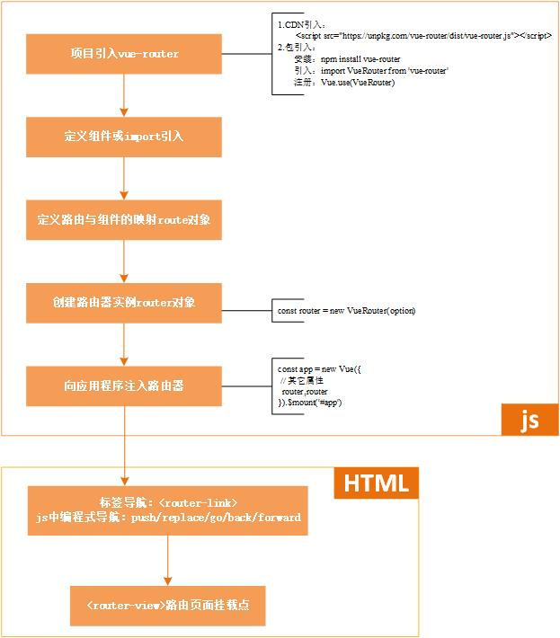
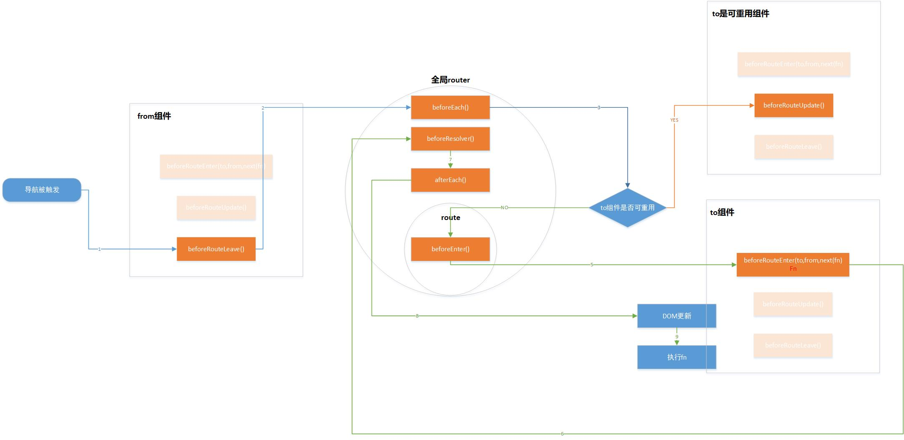

# vue-router路由的基本使用

一张图阐述vue-router的基本使用步骤


```js
// 0. 如果全局使用CDN引入：vue 引入在前，vue-router引入在后
// <script src="https://unpkg.com/vue/dist/vue.js"></script>
// <script src="https://unpkg.com/vue-router/dist/vue-router.js"></script>
// 如果模块化工程，已安装：npm install vue-router
import Vue from 'vue'
import VueRouter from 'vue-router'
Vue.use(VueRouter)

// 1. 定义 (路由) 组件。
// 可以从其他文件 import 进来
// const Foo = () => import(./foo)
const Foo = { template: '<div>foo</div>' }
const Bar = { template: '<div>bar</div>' }

// 2. 定义路由
// 每个路由应该映射一个组件。 其中"component" 可以是
// 通过 Vue.extend() 创建的组件构造器，
// 或者，只是一个组件配置对象。
// 我们晚点再讨论嵌套路由。 
const routes = [
  { path: '/foo', name: 'foo', component: Foo },
  { path: '/bar', name: 'bar', component: Bar }
]

// 3. 创建 router 实例，然后传 `routes` 配置
// 你还可以传别的配置参数, 不过先这么简单着吧。
const router = new VueRouter({
    // 还有其它配置项
  routes // (缩写) 相当于 routes: routes
})

// 4. 创建和挂载根实例。
// 记得要通过 router 配置参数注入路由，
// 从而让整个应用都有路由功能，在任意组件实例中都可以调用this.$router  this.$route
const app = new Vue({
  router
}).$mount('#app')
```

```html
<div id="app">
  <h1>Hello App!</h1>
  <p>
    <!-- 使用 router-link 组件来导航.也可以在js中使用编程式导航 -->
    <!-- 通过传入 `to` 属性指定链接. -->
    <!-- <router-link> 默认会被渲染成一个 `<a>` 标签,也可以通过tag属性定义 -->
    <router-link to="/foo">Go to Foo</router-link>
    <router-link to="/bar">Go to Bar</router-link>
  </p>
  <!-- 路由出口 -->
  <!-- 路由匹配到的组件将渲染在这里 -->
  <router-view></router-view>
</div>
```

## option配置项
```js
const router = new VueRouter(option)
```
```js
const option = {
    routes: routeConfig,   // 路由对象，单独讲解，见下面
    // 路由模式，在浏览器端只有两种：hash / history，默认hash。nodejs环境下默认abstract
    mode: "hash" | "history" | "abstract",
    base: "/", // 应用的基路径。
    linkActiveClass: "router-link-active",  // 全局配置激活导航的类名，默认值router-link-active
    linkExactActiveClass: "router-link-exact-active", // 全局配置精确激活的导航类名，即只应用于当前导航项
    //定义滚动行为，返回一个位置坐标
    scrollBehavior: (to,from,savedPosition) => {/** do something */ return  PositionDescriptor[,Promise<PositionDescriptor>]},
    // 当浏览器不支持 history.pushState 控制路由是否应该回退到 hash 模式。默认值为 true。
    fallback: true, 
    // 提供自定义查询字符串的解析/反解析的函数。覆盖默认行为。
    parseQuery,
    stringifyQuery,
}
```

## route
1. route定义
```js
const routeConfig = [
    {
        name?: string, // 命名路由
        path: string, // 声明路由路径
        component: '', // 该路由关联的组件，可以实现懒加载，接受异步返回组件的Promise对象。
        components?: { [name: string]: Component }, // 命名视图组件
        children?: Array<RouteConfig> // 定义嵌套路由
        redirect?: string | Location | Function, // 指定重定向路由，接受字符串、对象、函数返回的路径或对象
        alias?: string | Array<string>, // 路由别名
        meta: {}, // 自定义路由的元信息，可以通过$route.meta获取
        props?: boolean | Object | Function, // boolean/object/function，允许指定为组件传递prop的方式。
        beforeEnter: (to,from,next) => {/** do something*/  next()}, // 路由独享守卫
    }
]
```
2. route路由对象
一个页面路径就含有一个route路由对象，可以用`this.$route`获取。
```js
this.$route = {
    name: '', // 当前路由的名称，建议定义时加上。
    path: '', // 字符串形式，对应当前路由的绝对路径，如 "/foo/bar"
    fullPath: '', // 完整的URL，包含查询参数和 hash 的完整路径。
    hash: '', // 当前路由的 hash 值 (带 #) ，如果没有 hash 值，则为空字符串。
    matched: [], // 一个数组，包含当前路由的所有嵌套路径片段的路由记录，比如包含children的嵌套路由
    params: {}, // 路由参数对象,一个 key/value 对象，对应路径/foo/:id,则$route.params.id如果没有则为一个空对象
    query: {}, // 一个 key/value 对象，表示 URL 查询参数。例如，对于路径 /foo?user=1，则有 $route.query.user == 1，如果没有查询参数，则是个空对象。
    meta: {}, // 路由元信息
    redirectedFrom: '', // 如果存在重定向，即为重定向来源的路由的名字
}
```

## router路由器实例对象
1.router对象属性
```js
this.$router.app  //router所在的vue根实例
this.$router.mode // 路由使用的模式：hash 或 history
this.$router.currentRoute // 当前页面的路由对象，同this.$route
```
2. router对象的方法
```js
// 编程式导航方法
// router.push('home')  字符串
// router.push({ path: 'home' }) 对象
// router.push({ name: 'user', params: { userId: '123' }}) // 命名路由,params必须与name同时存在才有效，单独与path存在无效。
// router.push({ path: 'register', query: { plan: 'private' }}) // 带查询参数，变成 /register?plan=private
router.push(location, onComplete?, onAbort?)
router.replace(location, onComplete?, onAbort?) // 同push
router.go(n)
router.back()
router.forward()

// 全局导航守卫，见路由钩子函数
router.beforeEach((to, from, next) => {/* must call `next` */next()})
router.beforeResolve((to, from, next) => {/* must call `next` */,next()})
router.afterEach((to, from) => {})

// 动态添加更多的路由规则。参数必须是一个符合 routes 选项要求的数组。
router.addRoutes(routes: Array<RouteConfig>)

// 路由加载的完工事件
router.onReady(callback, [errorCallback])
router.onError(callback)
// 错误捕获：
// 在一个路由守卫函数中被同步抛出；
// 在一个路由守卫函数中通过调用 next(err) 的方式异步捕获并处理；
// 渲染一个路由的过程中，需要尝试解析一个异步组件时发生错误。
```

## 路由钩子函数
```js
// 全局守卫，在router对象中声明
router.beforeEach((to, from, next) => {/* must call `next` */next()})
router.beforeResolve((to, from, next) => {/* must call `next` */,next()})
router.afterEach((to, from) => {})

// 路由独享守卫，在route中声明
beforeEnter: (to,from,next) => {/** do something*/  next()}, // 路由独享守卫

// 组件守卫，在组件实例选项对象option中声明
beforeRouteEnter (to, from, next) {
// 在渲染该组件的对应路由被 confirm 前调用
// 不！能！获取组件实例 `this`,因为当守卫执行前，组件实例还没被创建
// 但是可以传入一个回调，next(vm => {// 通过 `vm` 访问组件实例})
},
beforeRouteUpdate (to, from, next) {
// 在当前路由改变，但是该组件被复用时调用
// 举例来说，对于一个带有动态参数的路径 /foo/:id，在 /foo/1 和 /foo/2 之间跳转的时候，
// 由于会渲染同样的 Foo 组件，因此组件实例会被复用。而这个钩子就会在这个情况下被调用。
// 可以访问组件实例 `this`
},
beforeRouteLeave (to, from, next) {
// 导航离开该组件的对应路由时调用
// 可以访问组件实例 `this`
}
```
**钩子函数的参数**
- to: Route对象- 即将要进入的目标路由
- from: Route对象- 当前导航正要离开的路由
- next: Function: 一定要调用该方法来执行resolve 这个钩子，否则不会被resolved,程序被无限等待。next方法的调用参数：
    
    - next(): 直接进行管道中的下一个钩子。
    - next(false): 中断当前的导航。
    - next(error): (2.4.0+) 如果传入 next 的参数是一个 Error 实例，则导航会被终止且该错误会被传递给 router.onError() 注册过的回调。
    - next('/') 或者 next({ path: '/' }): 跳转到一个不同的地址。当前的导航被中断，然后进行一个新的导航。

**导航守卫被解析完整流程**
```
1.导航被触发。
2.在失活的组件里调用离开守卫beforeRouteLeave。
3.调用全局的 beforeEach 守卫。
4.在重用的组件里调用 beforeRouteUpdate 守卫 (2.2+)。
5.在路由配置里调用 beforeEnter。
6.解析异步路由组件。
7.在被激活的组件里调用 beforeRouteEnter。
8.调用全局的 beforeResolve 守卫 (2.5+)。
9.导航被确认。
10.调用全局的 afterEach 钩子。
11.触发 DOM 更新。
12.用创建好的实例调用 beforeRouteEnter 守卫中传给 next 的回调函数。
```


## `<router-link>`
- to
``` html
<!-- 与$router.push写法基本一样 -->
<!-- 字符串 -->
<router-link to="home">Home</router-link>
<!-- 使用 v-bind 的 JS 表达式 -->
<router-link v-bind:to="'home'">Home</router-link>

<!-- 不写 v-bind 也可以，就像绑定别的属性一样 -->
<router-link :to="'home'">Home</router-link>

<!-- 同上 -->
<router-link :to="{ path: 'home' }">Home</router-link>

<!-- 命名的路由 -->
<router-link :to="{ name: 'user', params: { userId: 123 }}">User</router-link>

<!-- 带查询参数，下面的结果为 /register?plan=private -->
<router-link :to="{ path: 'register', query: { plan: 'private' }}">Register</router-link>
```
- replace
```html
<!-- 设置 replace 属性的话，当点击时，会调用 router.replace() 而不是 router.push()，于是导航后不会留下 history 记录。 -->
<router-link :to="{ path: '/abc'}" replace></router-link>
```
- tag
```html
<!-- 默认为a标签 -->
<router-link to="home">Home</router-link>
<!-- 渲染结果 -->
<a href="home">Home</a>

<!-- 有时候想要 <router-link> 渲染成某种标签，例如 <li>。 于是我们使用 tag prop 类指定何种标签，同样它还是会监听点击，触发导航。 -->
<router-link to="/foo" tag="li">foo</router-link>
<!-- 渲染结果 -->
<li>foo</li>
```
- active-class
- exact-active-class
- exact
```
active-class
自定义链接激活时使用的 CSS 类名 ，也可以通过路由的构造选项 linkActiveClass 来全局配置。
exact-active-class
配置当链接被精确匹配的时候应该激活的 class。注意默认值也是可以通过路由构造函数选项 linkExactActiveClass 进行全局配置的。
exact
是否执行精确匹配路径，来使用设置的激类
```

- append
```
是否在当前 (相对) 路径前添加基路径，即base的值
```
- event
```
声明可以用来触发导航的事件，默认click
```
## `<router-view>`
- name
如果` <router-view name="">`设置了名称，则会渲染对应的命名路由配置中 components 下的相应组件。

## 路由传递参数的方式
- **方式一：路由动态参数**
```js
// route配置
{
    path: '/user/:userId',
    name: '***',
    component: ***
}
```
```js
// 路由跳转
this.$router.push({path:`/user/${userId}`})
```
```js
// 目标组件内接收参数
this.$route.params.userId
```
- **方式二：命名路由传参,使用name和params**
```js
// 前提对应route有配置name
// 跳转跳转
this.$router.push({name:'Login',params:{id:'leelei'}})

// 目标组件内接收参数
this.$route.params.id
```

- **方式三：查询参数传参，使用path和query**
```js
// 此时url会携带query： /login?id=leelei
this.$router.push({path:'/login',query:{id:'leelei'})

// 目标组件内接收参数
this.$route.query.id
```
query传参是针对path的，params传参是针对name的。

- **方式四：prop**
```js
// 目标组件
const User = {
  props: ['id'],
  template: '<div>User {{ id }}</div>'
}
```

- props：Boolean
当route配置中props：true时，不管是动态参数路由/user/:id，还是通过命名路由（name和params)传递的参数，params的值都会传入组件内的props。
```js
// 对应的route配置props
const router = new VueRouter({
  routes: [
    { path: '/user/:id', component: User, props: true },
  ]
})
```
```js
// 跳转目标组件，此时user组件接收的props中的id=314391
this.$router.push('/user/314391')
```

- props: Object
如果 props 是一个对象，它会被按原样设置为组件属性。当 props 是静态的时候有用。

```js
const router = new VueRouter({
  routes: [
    { path: '/user', component: User, props: { id: 314391 } }
  ]
})
```

- props: Function
如果props是一个函数形式，函数默认参数route对象，这样你便可以复用route对象属性，动态传值。props也将变成动态形式，类似父子组件动态值参。比如将静态值与基于路由的值结合等等。
```js
const router = new VueRouter({
  routes: [
    { path: '/user', component: User, props: (route) => ({ query: route.query.q }) }
  ]
})
```
此时/search?q=314391 会将 {query: '314391'} 作为属性传递给 User 组件。

> 通过路由传入props不被this.$attrs接收

看一个官方例子
```html
<!-- 用记事本新建一个html，复制代码保持，直接在浏览器打开查看效果 -->
<!DOCTYPE html>
<html lang="zh">
<head>
    <meta charset="UTF-8">
    <title>Document</title>
</head>
<body>
    <div id="app">
        <h1>Route props</h1>
        <ul>
            <li><router-link to="/">/</router-link></li>
            <li><router-link to="/hello/you">/hello/you</router-link></li>
            <li><router-link to="/static">/static</router-link></li>
            <li><router-link to="/dynamic/1">/dynamic/1</router-link></li>
            <li><router-link to="/attrs">/attrs</router-link></li>
        </ul>
        <button @click="handleClick">编程式导航传递参</button>
        <router-view class="view" foo="123"></router-view>
    </div>
</body>
<script src="https://unpkg.com/vue"></script>
<script src="https://unpkg.com/vue-router/dist/vue-router.js"></script>
<script>
const Hello = Vue.extend({
    template: `<div>
                <h2 class="hello">Hello {{name}} {{ $attrs }}</h2>
            </div>`,
    props: {
        name: {
            type: String,
            default: 'Vue!'
        }
    }
})

function dynamicPropsFn (route) {
  const now = new Date()
  return {
    name: (now.getFullYear() + parseInt(route.params.years)) + '!'
  }
}

const router = new VueRouter({
//   mode: 'history',
//   base: __dirname,
  routes: [
    { path: '/', component: Hello }, // No props, no nothing
    { path: '/hello/:name', component: Hello, props: true }, // Pass route.params to props
    { name: 'push', path: '/push', component: Hello, props: true }, // Pass route.params to props
    { path: '/static', component: Hello, props: { name: 'world' }}, // static values
    { path: '/dynamic/:years', component: Hello, props: dynamicPropsFn }, // custom logic for mapping between route and props
    { path: '/attrs', component: Hello, props: { name: 'attrs' }}
  ]
})

const vm = new Vue({
    el: "#app",
    router,
    methods: {
        handleClick() {
            this.$router.push({
                name: 'push',
                params: {
                    name: 'push'
                }
            })
        }
    }
})
</script>
</html>
```